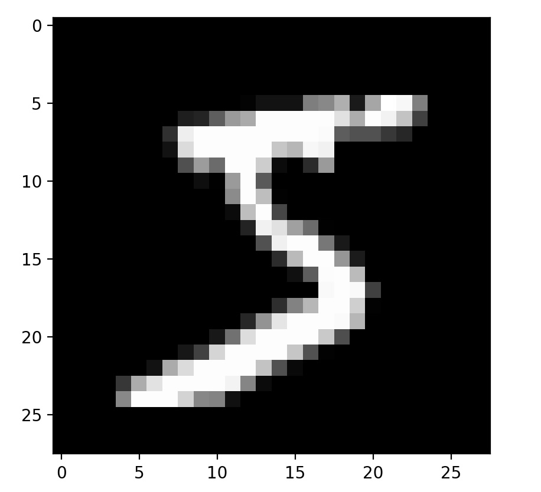
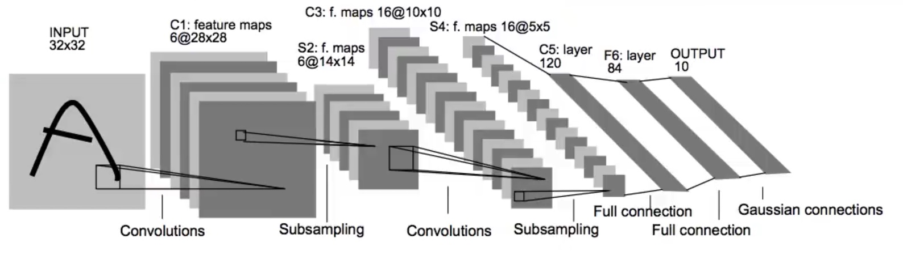
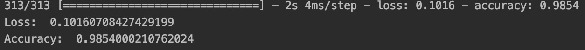

# Hand-written-digit-recognizer

## About
The task is to build a hand-written digit recognizer using a LeNet-5 CNN, based on the mnist dataset in Keras.

Keras mnist dataset is a large database of handwritten digits that is commonly used for training various image processing systems. The database is also widely used for training and testing in the field of machine learning. It has 60,000 images for training, and 10,000 images for testing. Each image has a size of 28x28 pixels, with a target variable indicating its correct digit.
The image in the dataset looks like this: 

with a target value of 5.

We will use Keras and Tensorflow to build the CNN. A LeNet-5 CNN looks at this: 

with 2 convolutional layers each followed by a pooling layer, with 2 full-connection layers and an output layer in the end.

## Steps
First we need to reshape our input image size to 28x28x1, the last 1 indicates the number of channels for the image. Since the image in mnist are all greyscale image, we will only need 1 channel to represent it. For a RGB color image, it's better to use 3 channels. This can be accomplished by using the `reshape` method.

To build the first convolutional layer, from the above LeNet-5 diagram, we can tell that the dimension of the convolution kernel is 5x5x6, because it turns the input image from 32x32 to 28x28, and 32-28+1=5. The implementation of a convolutional layer in Keras is pretty easy, simply use: 
`Conv2D(filters=6, kernel_size=(5, 5), strides=(1, 1), input_shape=(28, 28, 1), padding='valid', activation='relu')`

After the first convolutional layer, there is a pooling layer. We will use an averagingpooling with a 2x2 kernel size here, which would simply be:
`AveragePooling2D(pool_size=(2, 2))`

Then comes another convolutional layer and pooling layer, we can simply repeat the steps above and change the parameters a little to match the size in diagram.

In the end, we will build two full-connection layers. Before that, we have to add a flatten layer to reshape the size of output from convolutional layer into a 1-d array. After that, it's easy to add full-connection layers.

By now, we have complete all the steps for LeNet-5 CNN. Now we can just train the network on the training dataset and evaluate its accuracy.

## Results
The model achieves a very high accuracy of 98.5% with a loss of around 0.10.

